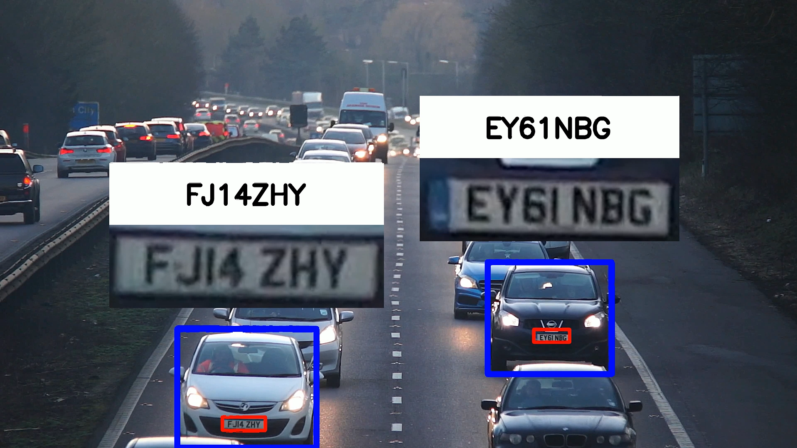

# License Plate Tracking using YOLOv11 & SORT

[](https://www.python.org/)
[](https://github.com/ultralytics/ultralytics)
[](https://github.com/abewley/sort)
[](LICENSE)

---

## 📘 Overview

This project focuses on **real-time license plate detection and tracking** using **YOLOv11** for detection and **SORT (Simple Online Realtime Tracking)** for object tracking across frames.  
The system processes live video feeds or recorded footage, detects license plates, assigns unique IDs, and tracks them consistently through the scene.

It’s built for **traffic analysis, surveillance, and vehicle tracking** applications, with GPU support for high-speed inference.

---

## ⚙️ Key Features

- 🚗 Real-time detection of vehicle license plates  
- 🧠 Integrated **YOLOv11** object detector with **SORT** tracker  
- ⚡ GPU acceleration using CUDA for faster performance  
- 🧩 Frame-by-frame ID consistency tracking  
- 🖼️ Visual overlay of bounding boxes and unique IDs on each frame  
- 📦 Modular structure for easy integration into larger systems  

---

## 🛠️ Tech Stack

| Component | Technology |
|------------|-------------|
| Detection | YOLOv11 (PyTorch) |
| Tracking | SORT |
| Video Processing | OpenCV |
| Language | Python |
| Hardware | GPU (NVIDIA RTX series recommended) |

---

## 📂 Repository Structure

```
License-Plate-Tracking_yolov11_SORT/
│
├── main.py                # Main script for detection + tracking
├── visualize.py           # Script to visualize tracked IDs
├── add_missing_data.py    # Optional script for dataset cleanup/augmentation
├── best.pt                # Fine-tuned YOLOv11 model for license plate detection
├── yolo11n.pt             # Base YOLOv11 model (for comparison)
├── requirements.txt       # List of dependencies
├── screenshot.png         # Example frame (output visualization)
└── README.md              # You are here
```

---

## 🧩 Installation

1. **Clone the repository**

   ```bash
   git clone https://github.com/Arunprakash-1903/License-Plate-Tracking_yolov11_SORT.git
   cd License-Plate-Tracking_yolov11_SORT
   ```

2. **Create a virtual environment (recommended)**

   ```bash
   python -m venv .venv
   .venv\Scripts\activate      # On Windows
   source .venv/bin/activate   # On Linux/macOS
   ```

3. **Install dependencies**

   ```bash
   pip install -r requirements.txt
   ```

4. **Verify GPU availability**

   ```python
   import torch
   print(torch.cuda.is_available())  # Should return True
   ```

---


## 📊 Results

- Achieved **real-time performance** with ~15–30 ms inference per frame on an **RTX 2050 GPU**
- Improved multi-object tracking consistency even under **occlusions and motion blur**
- Generated **clear, labeled outputs** for license plates in traffic videos

**Example Output Frame:**




## 🧠 Learning Highlights

This project strengthened my understanding of:
- Multi-object tracking pipelines (Detection → Association → Update)
- YOLO model fine-tuning on small, domain-specific datasets
- Balancing real-time inference vs. accuracy in computer vision
- GPU optimization using PyTorch and OpenCV

---

## 🪪 License

This repository is distributed under the [MIT License](LICENSE).  
You are free to modify, distribute, or use it for both academic and commercial purposes.

---

## 📬 Contact

**Arun Prakash**  
💻 [GitHub](https://github.com/Arunprakash-1903)  
📧 Email: arunprakash2225@gmail.com  

---

⭐ *If you found this useful, consider giving the repository a star!*
